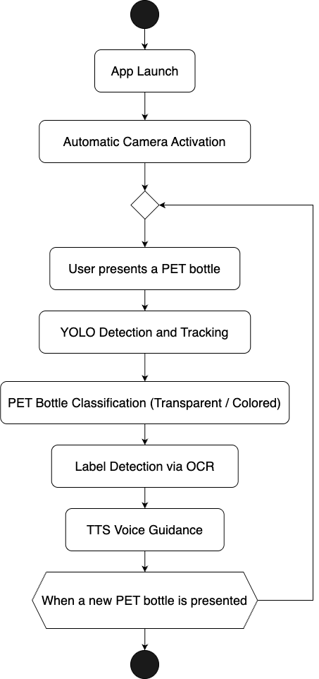

# PET Bottle Classifier with Audio Guide for the Visually Impaired

## 1. Introduction

This project aims to assist visually impaired individuals in separating waste plastic bottles by detecting whether a PET bottle is transparent or opaque and whether it has a label. In South Korea, since 2022, it has become mandatory to separate transparent PET bottles from colored or opaque ones. However, this distinction is almost impossible for visually impaired people to make through touch alone.

While basic assistive features such as braille exist on some products, they do not provide enough information to differentiate between transparent and opaque plastics. Recognizing the environmental and accessibility challenges, our team developed a mobile application that utilizes AI-based object detection and OCR to classify PET bottles and provide real-time audio guidance via TTS (Text-to-Speech).

By combining accessibility technology with environmental consciousness, our system offers a novel and practical solution for inclusive waste management.

---

## 2. Training Data Source

We used the official open dataset provided by AI Hub:

📦 [Recyclable Waste Sorting and Classification Dataset (AIHub)](https://www.aihub.or.kr/aihubdata/data/view.do?searchKeyword=%EC%9E%AC%ED%99%9C%EC%9A%A9+%EB%B6%84%EB%A5%98+%EB%B0%8F+%EC%84%A0%EB%B3%84+%EB%8D%B0%EC%9D%B4%ED%84%B0%EC%85%8B&aihubDataSe=data&dataSetSn=71362)

- Total Images: ~26,000
- Labels: Transparent PET (0), Opaque PET (1)
- Preprocessing: JSON to YOLO `.txt` format
- Dataset split: 80% training / 10% validation / 10% test
- Augmentation applied: brightness, angle, background variation

---

## 3. Block Diagram

### 🧠 System Flow Diagram

This diagram illustrates the internal system process — from capturing camera frames, running the YOLOv11n model for object detection, applying OCR for label recognition, and finally providing real-time audio feedback via TTS.

---

### 👤 User Flow Diagram

This diagram shows how users interact with the application — from launching the app to receiving classification results through TTS, based on PET bottle detection and label recognition.

---

## 4. YouTube

📺 Project Demo Video: 

---

